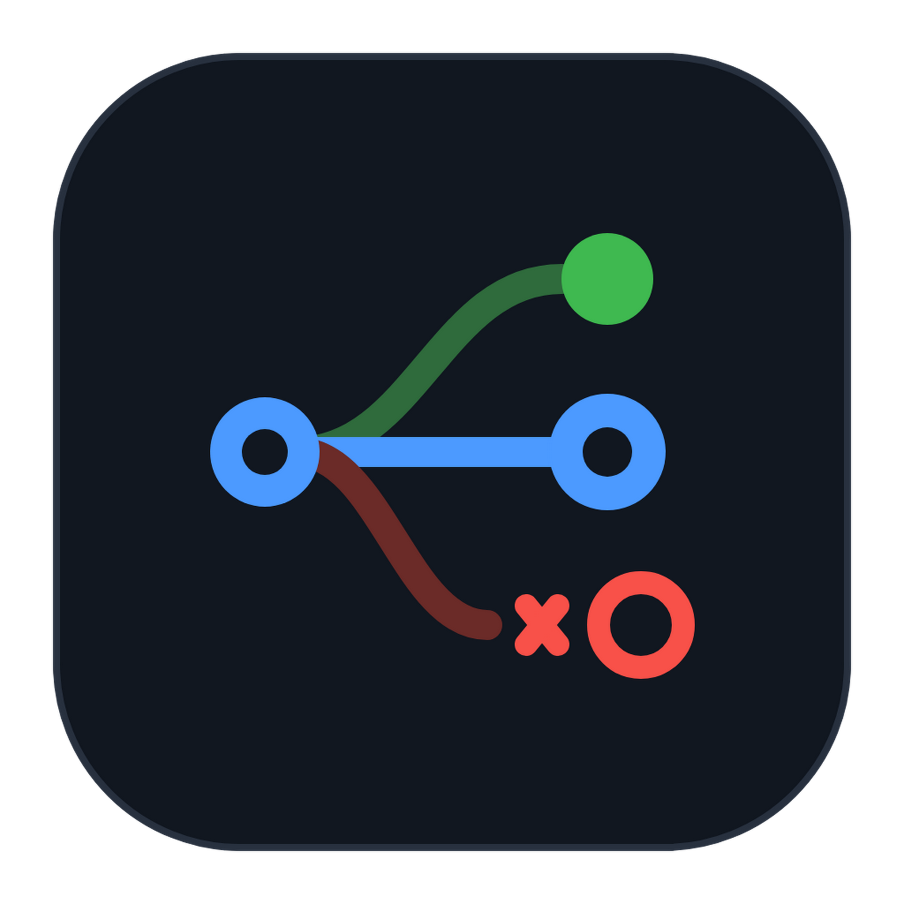
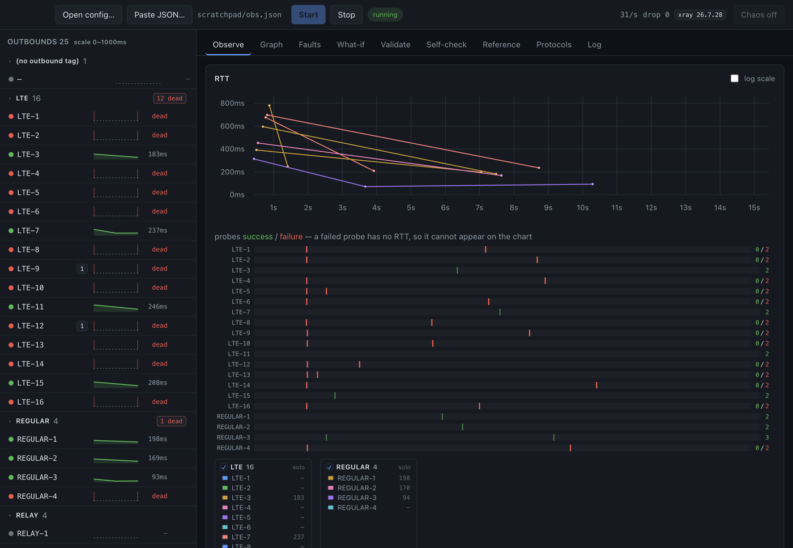

# Xray Studio

A desktop tool for testing Xray-core configurations: it shows **why** a load balancer
picked a particular outbound, and lets you make specific outbounds unreachable in a way
that is indistinguishable from a real network failure.

Built against **Xray-core v26.7.28**.

> **Alpha.** Interfaces and file formats may change without notice. More importantly:
> fault injection acts on the **real servers in the config you open** — there is no
> sandbox or lab mode, by design, because a simulated failure would not prove anything
> about your actual setup. Do not point it at production you cannot afford to disturb.



## Install

Download from [Releases](../../releases):

| | |
|---|---|
| **macOS** 14+, Apple Silicon | `.dmg` — open it, drag the app to Applications |
| **Windows** 10+, x64 or arm64 | `-setup.exe` installer, or the `.zip` to run in place |
| **Linux** x64 or arm64 | `.AppImage` — `chmod +x` and run — or the `.tar.gz` |

The build is unsigned and un-notarised — signing needs a paid Apple Developer identity,
and an ad-hoc signature would only make Gatekeeper's refusal more confusing. macOS will
refuse to open it until you clear the quarantine flag once:

```bash
xattr -dr com.apple.quarantine "/Applications/Xray Studio.app"
```

Intel Macs are not built. Everything else is: the fault dialer's errno layer is
build-tagged per platform, and the Windows variant synthesises the WSA* errors —
`connectex: ... actively refused it` rather than a Unix `connect: connection refused` —
because a fault that reported the wrong platform's errno would be a tell.

Only the macOS build is signed-adjacent enough to mention: none of them are signed. On
Windows, SmartScreen will warn about an unknown publisher; on Linux the AppImage needs
`chmod +x`.

To build from source instead, see [Getting started](#getting-started).

## Why it exists

None of the balancer's reasoning is available from Xray's own API:

- `RoutingService.GetBalancerInfo` returns only `{override, principle_target}` — no
  strategy, no candidates, no scores, no rejection reasons. For `random` and
  `roundRobin` it returns the *raw unfiltered* selector output; for `leastPing` a
  single tag; only for `leastLoad` a ranked list, and even then post-truncation and
  score-free.
- `SubscribeRoutingStats` is dead code: `app/router/command/command.go` always passes
  `nil` for the stats channel, so it answers `"Routing statistics not enabled."`
  forever, with no config knob to change that.
- Probe start/finish, individual RTT samples, and per-connection rule matches are not
  exposed at all.
- When a strategy returns nothing and no `fallbackTag` is set, the dispatcher silently
  routes to the **first outbound in the config** and discards the error text.

So the core is patched — minimally, additively, and reproducibly — to emit what is
missing.

## Layout

```
xray/          PIN + the 9-patch telemetry series (the source of truth)
scripts/       bootstrap, pin verification, rebase, dev, test, package, icon
sidecar/       Go: runs one Xray instance, injects faults, serves telemetry
app/           Electron + React UI
tools/         docsgen and schemagen, run against the pinned sources
data/          generated: parameter docs (CC BY-SA 4.0) and protocol schema
assets/        icon source and the generated .icns/.png
.build/        gitignored: the patched checkout, binaries and release artefacts
```

## Getting started

Needs **Go ≥ 1.26**, **Node ≥ 22**, **git**, and a network connection on first run (the
Xray-core checkout is cloned, not vendored). Developed on macOS arm64; the fault
dialer's errno layer is behind a build tag and only `_unix` exists so far, so Windows
will not build yet.

```bash
scripts/dev.sh
```

That clones Xray-core at the pinned commit, applies the patch series, builds the
sidecar, installs the app's dependencies and opens the window. Roughly a minute cold,
seconds warm.

If the clone step fails on `git am`, it is almost always commit signing — the bootstrap
disables it inside the checkout, but a `gpg.program` that prompts can still stall.

Then **Open config…**, pick an Xray config, and press **Start**. To skip the picker
while iterating:

```bash
XRAYSTUDIO_CONFIG=/path/to/config.json scripts/dev.sh
```

The **Validate** tab is the one worth opening first. Xray already rejects malformed
configs; what it will not tell you about is the config it *accepts* and then does not
act on. Those are reported as **silently broken**: a selector matching no outbound
(never checked, because balancers are built before outbounds exist), `leastLoad` with
no observatory (fails with the opaque "not all dependencies are resolved."), a
`fallbackTag` pointing nowhere (traffic quietly leaves via the *first* outbound),
`tolerance` set without `burstObservatory` (parses, clamps, never consulted), or a key
nothing reads — Go's JSON decoder ignores unknown fields, so `"balancer"` instead of
`"balancers"` behaves exactly as if the block were absent.

The known-key set is derived by reflecting over the `infra/conf` structs rather than
written by hand, so it cannot drift from the parser as Xray evolves. Try
`examples/broken-showcase.json`.

The **Reference** tab is a searchable index of 187 config parameters, and the same text
appears as hover hints (`?`) next to the controls that map onto them. It is generated by
`tools/docsgen` from a pinned commit of XTLS/Xray-docs-next — pinned for the same reason
the core is, since unpinned upstream text would silently change what the app tells you
about your config:

```bash
go -C tools run ./docsgen -out ../data/docs-en
```

The **Build** tab edits the config through the diagram: click a node, change its
properties, add or remove outbounds, balancers and rules. Every change is a *minimal
text patch* (`jsonc-parser`), never a re-serialisation — so protocol settings, TLS,
Reality, `mux`, your comments and your formatting all survive untouched. The graph only
models tags, balancers and routing rules; rebuilding JSON from it would silently delete
everything else.

Nothing is written until you press **Save to file**, and the draft is validated through
the sidecar's real loader first. Renames follow their references (`fallbackTag`,
`outboundTag`, a rule's `balancerTag`) but deliberately do *not* rewrite balancer
selectors — a selector is a prefix pattern, not a reference, so the editor reports that
the outbound has left the balancer instead of guessing.

The **Editor** tab is the config as text, with a hint for whatever the pointer is over.
Hover resolution is exact rather than heuristic: the text is monospace, so a pointer
position maps arithmetically to a character offset, and `getLocation` turns that offset
into the JSON path the documentation is keyed by. It is not Monaco — that would be ~5 MB
and a CSP widened for web workers, in exchange for a JSON language service that knows
nothing about Xray. Highlighting comes from the same `jsonc-parser` scanner used for
every surgical edit, so it cannot disagree with the parser about what a token is.

The **Protocols** tab covers the one part of a config the rest of the tool is blind to.
The validator derives its known keys by *reflecting* over `conf.Config`, which is exact
and can never drift from the linked core — but `inbounds[].settings` and
`outbounds[].settings` are a `json.RawMessage` decoded later by a string-keyed registry,
so reflection stops at that boundary. `tools/schemagen` recovers the mapping by parsing
the registry literals with `go/ast`, because the source is the only place that records
that `"vless"` means `VLessOutboundConfig`:

```bash
go -C tools run ./schemagen -src ../.build/xray-core/infra/conf -out ../data/schema
```

Descriptions come from the official docs where they exist and from the field's own
source comment otherwise, always labelled so the two are never confused.

The **Self-check** tab continuously re-derives the dashboard's own claims from the
core's answers, so a wrong claim becomes visible instead of quietly misleading. Its
oracle is `Router.GetPrincipleTarget`, chosen because it is side-effect free for all
four strategies — `TestRoute` would advance round-robin's rotation index and re-roll
the random draw, corrupting the behaviour being measured.

The **What-if** tab answers "what would this balancer do if maxRTT were 200ms, or if
this outbound died?" — and it answers by running the *real* strategy code in the sidecar
against a frozen observation, then reporting the outcome over 1,000 trials. That last
part matters: `random` and `leastLoad` finish with a uniform draw, so with more than one
survivor there is no single answer, only a distribution.

`examples/demo-leastload.json` is a runnable starting point: four outbounds, a
`leastLoad` balancer with `expected: 2`, and an observatory probing
`cp.cloudflare.com`. Open the **Faults** tab, blackhole one of the `proxy-*` tags, and
watch the observatory notice and the balancer fail over — the **Observe** tab's
funnel will name the reason.

```bash
scripts/test.sh
```

### Dev environment variables

| | |
|---|---|
| `XRAYSTUDIO_CONFIG=<path>` | open and start a config on launch |
| `XRAYSTUDIO_TRACE=<path>` | append main-process diagnostics (window lifecycle, sidecar port and token) to a file — Electron's main-process stdout is not reliably captured when launched detached, which otherwise makes "no window appeared" undiagnosable |
| `XRAYSTUDIO_SHOT=<png>[,<ms>]` | capture the window from inside the app, bypassing macOS Screen Recording permissions |
| `XRAYSTUDIO_SHOT_JS=<js>` | run JS in the renderer before capturing (to pick a tab or scroll) |

## How it works

**The patched core** (`xray/patches/`, 9 commits, ~380 lines across 12 files) adds a
`xraytrace` package with three nil-by-default hooks: probe events, balancer decisions,
routing rule matches. When the hooks are unset the cost is a nil comparison and
behaviour is byte-identical to upstream.

The decision trace is **threaded through the real balancer code**, not reimplemented
beside it — `PickOutbound` calls `PickOutboundTraced` with a nil trace, and every
trace method is nil-safe. There is exactly one implementation of each balancing
algorithm, so the explanation cannot drift from the behaviour it explains. See
[xray/README.md](xray/README.md).

**The sidecar** embeds xray-core as a library (no fork needed for this part) and
replaces its system dialer via the exported, API-stable
`internet.UseAlternativeSystemDialer`.

**Fault injection keys on the outbound tag**, read from the dial context. That is the
whole point: two outbounds can share a server IP and port, and a packet filter
physically cannot tell them apart — `pf` and `iptables` see identical 5-tuples. A tag
can. `sidecar/e2e_test.go` proves exactly this case.

Faults are faithful because observatory probes and user traffic take the *same* dial
path, so health checks see the failure the same way real connections do — which is how
a firewall whitelist behaves. Synthesized errors are asserted byte-identical to real
kernel errors (`sidecar/fault/fault_test.go` compares against a genuine
`ECONNREFUSED` from `127.0.0.1:1`), and live connections are torn down too, since a
firewall does not wait politely for existing flows to finish.

### What the faults cannot do

Stated here and surfaced in the UI, because the claim is "as if genuinely unreachable"
and it is only mostly true:

1. `sockopt.dialerProxy` hops get a pipe from `redirect()` and never reach the dialer.
2. WireGuard's inner gVisor netstack dials bypass it; only the outer UDP is covered.
3. `burstObservatory`'s `connectivity` check uses a bare `http.Client` outside Xray.
4. No TCP segment loss (userspace can only stall or jitter), no ICMP, no PMTUD.
5. DNS failure is partial — resolution can happen before the dialer is reached.

## Status

| | |
|---|---|
| M0 — pinned + patchable core, sidecar, app shell | done |
| M1.1 — telemetry patch series + decision trace | done |
| M1.2 — event bus + control plane | done |
| M1.3 — fault engine | done |
| M1.4 — main process, sidecar supervision, 30Hz event store | done |
| M1.5–M1.7 — dashboard: probe table, RTT chart, decision funnel, faults, graph | done |
| M1.8 — what-if simulator | done |
| M1.9 — self-check | done |
| **M1 complete** | |
| M2.1 — validator (silent dysfunction) | done |
| M2.2 — per-parameter docs from XTLS/Xray-docs-next | done |
| M3 — visual config editing | done |
| M4 — protocol schema generated from infra/conf | done |

## Environment note

`~/Documents` is synced by iCloud Drive on this machine, which creates
`filename 2.go` conflict copies when files change quickly — and duplicate `.go` files
break the Go build with redeclaration errors. `.build/` and `app/node_modules` are
marked with the `com.apple.fileprovider.ignore#P` attribute to keep them out of sync.
If stray `* 2.*` files reappear:

```bash
find . -name "* [0-9].*" -not -path "./.git/*" -delete
```

## Licensing

Xray-core is **MPL-2.0**; the patches in `xray/patches/` are modifications of MPL-2.0
files and remain so.

The parameter text in `data/docs-en/` is **adapted from XTLS/Xray-docs-next and is
CC BY-SA 4.0**. Because it is adapted material, ShareAlike applies to it — so it lives
in its own directory with its own `LICENSE` and `ATTRIBUTION.md`, and every tooltip
links back to the upstream page. That obligation covers the extracted text only; it
does not extend to this project's code, which merely reads the file at runtime.

The app's own explanatory copy — the rejection reasons, the notes about behaviour the
official docs do not mention — is deliberately kept separate from the extract, so
neither is misattributed to the other.

## Packaging

```bash
npm run package
```

```bash
npm run package -- linux     # or: mac, win, all
```

Verifies the pinned core, runs the tests and **refuses to package if they fail**, builds
the sidecar for *every* target — so a Windows-only break surfaces on a macOS release
rather than waiting for a Windows one — builds the renderer, and writes the installers
plus a source archive to `.build/dist/`.

macOS, Windows and Linux artefacts can all be produced from a Mac; CI builds each on its
own runner anyway, because an AppImage assembled on Linux and an installer assembled on
Windows are the ones users will actually run.

The source archive comes from `git archive` at HEAD, not from the working tree. That
means it contains exactly the tracked files — it cannot pick up `node_modules`, the
patched core or a previous release artefact — and if the working tree has drifted from
HEAD the script says so, because the binaries would then have been built from something
the archive does not describe. The Go binary and the generated `data/` bundles ship as
`extraResources` outside the asar — the sidecar has to be a real file on disk to be
spawned, and the data files are looked up by path.

The icon is generated from `assets/icon.svg`:

```bash
npm run icon
```

It rasterises through Chromium rather than ImageMagick, which without a librsvg delegate
silently drops every stroke — the first attempt came out as three dots with all the
connecting lines missing and no warning.

Tagging `v*` runs the same script in CI and attaches the artefacts to a **draft**
pre-release, so nothing is downloadable until it has been looked at.

## License

See [`LICENSE`](LICENSE). Third-party terms — Xray-core under MPL-2.0 and the
documentation text under CC BY-SA 4.0 — are set out in
[`THIRD-PARTY.md`](THIRD-PARTY.md), along with how a release satisfies MPL's source
requirement: the patched core is reproducible from `xray/PIN` and `xray/patches/`, not
merely available.
