# A tour of the tabs

Every screenshot below is the real application, captured from inside its own window
while running [`examples/demo-leastload.json`](../examples/demo-leastload.json) against
the live network — three `proxy-*` outbounds, a `leastLoad` balancer with `expected: 2`,
and an observatory probing `cp.cloudflare.com`. Nothing here is a mock-up; the numbers
are measurements taken as the picture was taken. To reproduce the set:

```bash
scripts/screenshots.sh
```

The left rail is always present. It lists the outbounds grouped by tag prefix, each with
a sparkline of its last sixty measurements and its most recent RTT, and below them the
balancers with their current pick. Selecting a host there carries into the Graph and the
Editor — the diagram is already on that node and the text is already scrolled to it.

---

## Observe — what the observatory sees

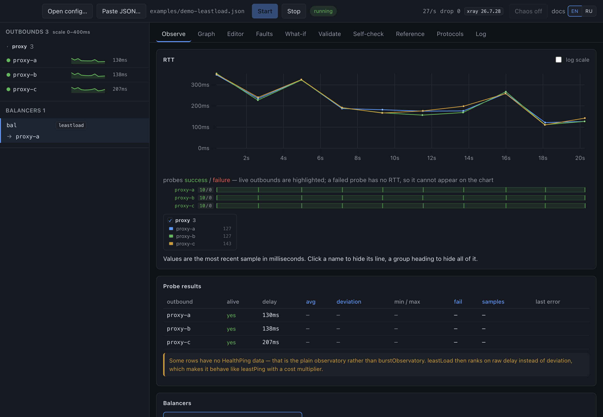

The RTT chart plots every successful probe. Failures cannot appear on it — a failed
probe has no round-trip time to plot — so they get their own lane underneath, one mark
per probe with a running success/failure count per host. That separation is deliberate:
the alternative is the observatory's dead marker, `99999999`, drawn as a spike that
rescales the whole axis and hides the differences you were looking at.

The **Probe results** table highlights the columns the *active* strategy actually sorts
by, so the table explains the ranking rather than being a wall of numbers. `leastLoad`
lights up deviation, average, failures and samples; `leastPing` lights up delay alone.

The warning at the bottom of the shot is one the official documentation does not make:
this config uses the plain `observatory`, which produces no HealthPing statistics, so
`leastLoad` has no deviation to rank on and quietly degenerates into `leastPing` with a
cost multiplier.

## The decision funnel — why *this* outbound

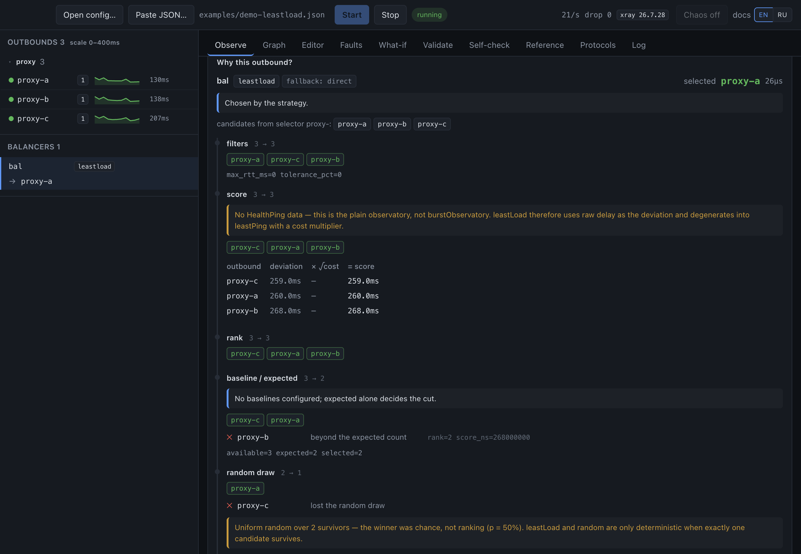

This is the reason the project exists. A balancer evaluates once per dispatched
connection, and every stage of that evaluation is shown: what went in, what survived,
and **why each loser was dropped**, with the numbers that justify it.

Read the shot from the top. Three candidates come out of the `proxy-` selector. The
filters stage keeps all three because `maxRTT` and `tolerance` are unset. The score
stage shows the arithmetic per survivor — `deviation × √cost = score` — and notes that
there is no HealthPing data behind those deviations. `baseline / expected` cuts the list
to two and names the one it dropped: *`proxy-c` — beyond the expected count*, with
`rank=2 score_ns=138000000` beside it. Two survivors then go into a uniform draw, and
the card says so in as many words: **the winner was chance, not ranking (p = 50%)**.

That last card matters more than it looks. `leastLoad` and `random` both finish with a
dice roll, so with more than one survivor there is no "the balancer chose X because X
was best" — there is a distribution, and a tool that presented one sample as a ranking
would be lying about it.

The trace is threaded through the *real* balancer code rather than reimplemented beside
it: `PickOutbound` calls `PickOutboundTraced` with a nil trace. There is exactly one
implementation of each algorithm, so the explanation cannot drift from the behaviour it
explains.

## Faults — making an outbound unreachable

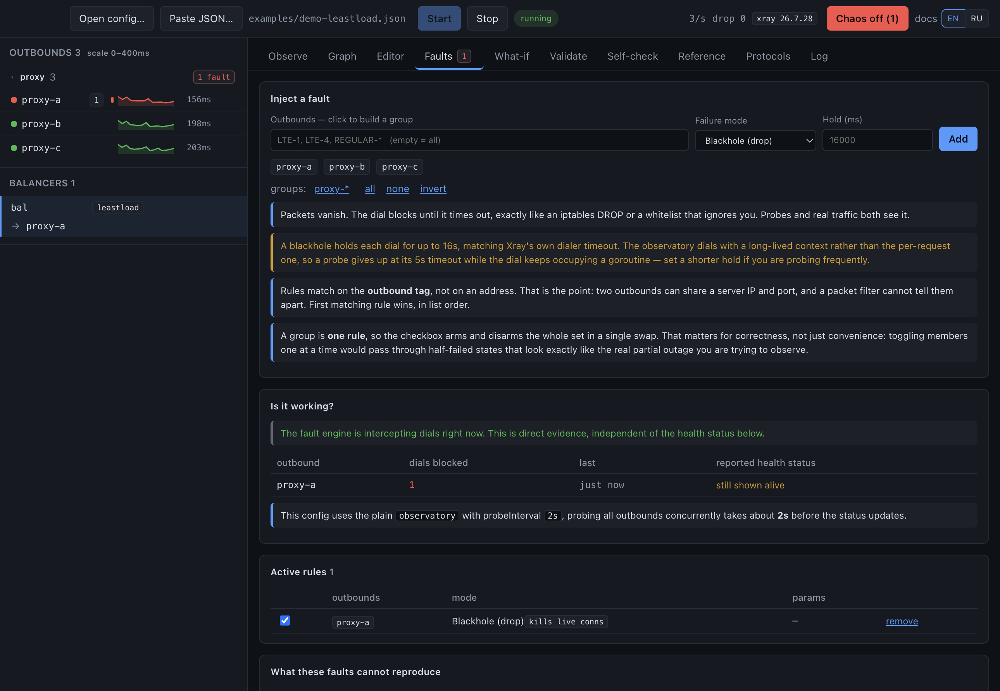

A fault rule matches on the **outbound tag**, which is the whole point. Two outbounds
can share a server IP and port, and a packet filter physically cannot tell them apart —
`pf` and `iptables` see identical 5-tuples. A tag can.

In the shot a blackhole has just been armed on `proxy-a`: the topbar has turned red with
a panic button that disarms everything at once, and the rail shows the host red with a
fault badge. Seconds later — visible in the Validate screenshot further down, taken from
the same session — the observatory has caught up and marks it `dead`.

**Is it working?** is the panel worth knowing about. It reports dials the fault engine
has actually intercepted — direct evidence, independent of what the health check thinks
— and here it says the engine has blocked a dial while the observatory *still shows the
host alive*. That is not a bug and the panel explains why: this config probes every 2s,
and a host stays alive while any sample in the window succeeded, so the status lags the
reality by a full round. Without this panel that gap reads as "the fault did nothing".

The failure modes are: blackhole (drop), connection refused, host and network
unreachable, DNS failure, TLS hang, TLS garbage, added latency, bandwidth throttling,
reset after N bytes, UDP packet loss, and a flaky duty cycle over any of the others.
Synthesised errors are asserted byte-identical to real kernel errors — the test compares
against a genuine `ECONNREFUSED` from `127.0.0.1:1` — and live connections are torn down
too, because a firewall does not wait politely for existing flows to finish.

The panel ends with the five things these faults **cannot** reproduce. That list is in
the interface rather than buried in documentation, because the claim being made is "as
if genuinely unreachable" and it is only mostly true.

## Graph — the config as a diagram, and an editor

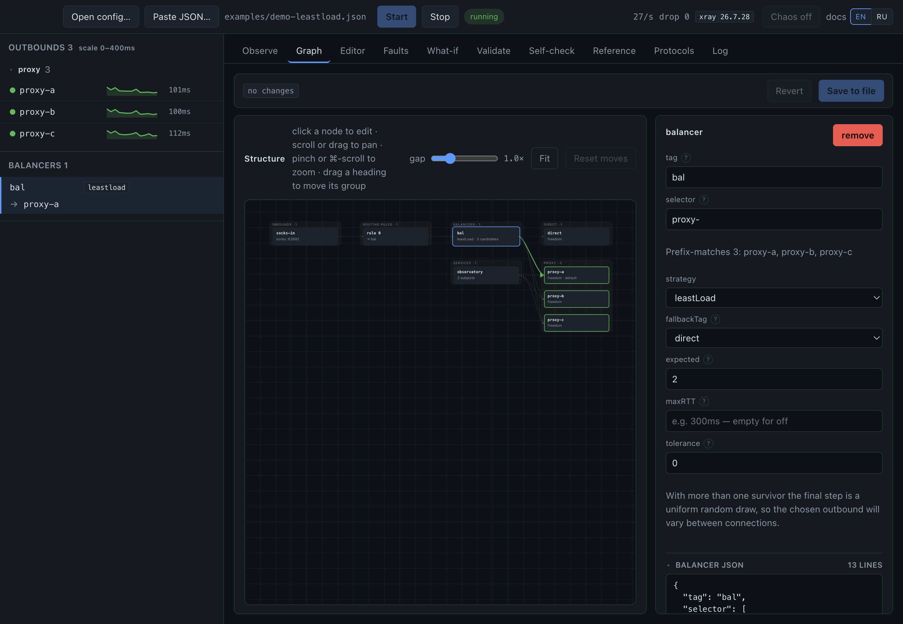

Inbounds, routing rules, balancers and outbounds in columns, with the observatory as a
service node on dashed edges. The live layer runs on top: the current pick is a thick
green edge, hosts under a fault get red hatching, probes pulse.

Clicking a node opens it in the inspector on the right, and every change is a **minimal
text patch** through `jsonc-parser`, never a re-serialisation. Protocol settings, TLS,
Reality, `mux`, your comments and your formatting all survive untouched — the graph only
models tags, balancers and rules, and rebuilding JSON from it would silently delete
everything it does not model.

Renames follow their references — `fallbackTag`, a rule's `outboundTag`, a rule's
`balancerTag` — but deliberately do **not** rewrite balancer selectors. A selector is a
prefix pattern, not a reference; rewriting it would be a guess. The editor reports that
the outbound has left the balancer instead.

Nothing reaches disk until **Save to file**, and the draft is validated through the
sidecar's real loader first.

## Editor — the config as text, annotated

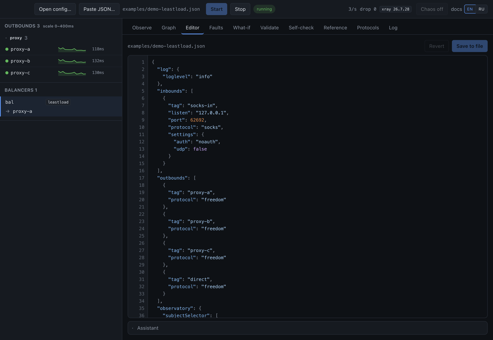

The whole file in one piece, with a hint for whatever the pointer is over. Hover
resolution is exact rather than heuristic: the text is monospace, so a pointer position
maps arithmetically to a character offset, and `getLocation` turns that offset into the
JSON path the documentation is keyed by. No token hit-testing, no per-span handlers on a
file that can run to thousands of lines.

Hovering is a glance and stays one — the hint is clamped, because 31 of the 360
documented parameters are longer than a screen (`dns.servers` alone runs to twenty-odd
paragraphs). Clicking the token pins it: the hint
keeps its place, takes the pointer, scrolls, and offers **full text ↗** into the
Reference tab for the entries where scrolling a popup is still the wrong way to read
something.

It is not Monaco. Monaco is ~5 MB, needs web workers the renderer's CSP would have to be
widened for, and brings a JSON language service that knows nothing about Xray.
Highlighting here comes from the same `jsonc-parser` scanner used for every surgical
edit, so it cannot disagree with the parser about what a token is.

## What-if — asking without touching anything

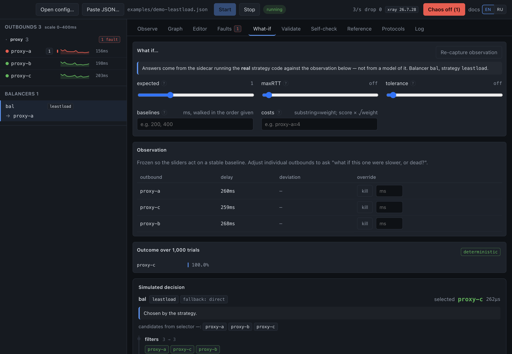

"What would this balancer do if `maxRTT` were 200ms, or if this outbound died?" The
observation is frozen so the sliders act on a stable baseline, and the answer comes from
the sidecar running the **real strategy code** against it — not from a model of that
code reimplemented in the interface.

The result is reported over 1,000 trials, because for `random` and `leastLoad` a single
answer would be a misrepresentation: they end in a uniform draw, so what exists is a
distribution. The badge beside it says which case you are in — the shot reads
`deterministic` because `expected` is at 1, leaving exactly one survivor for the draw to
pick from. Move that slider and the badge changes with the answer.

Below the sliders the frozen observation is editable per host: override a delay, or
`kill` a host outright, and the simulated decision underneath re-runs with every stage
of the funnel intact.

## Validate — configs that load and then do nothing

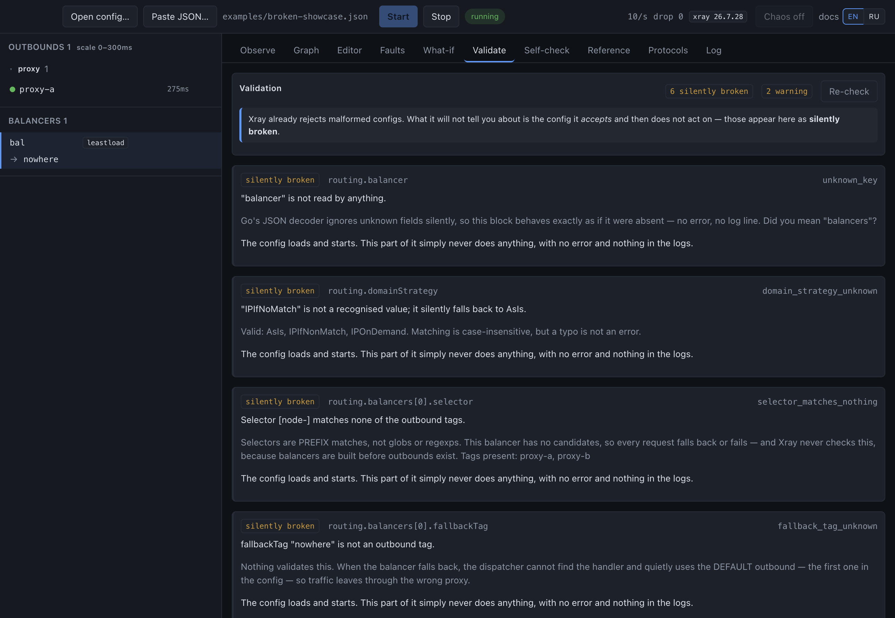

Xray already rejects malformed configs; that is the easy half. What it will not tell you
about is the config it *accepts* and then never acts on. Those are reported here as
**silently broken**:

- a balancer selector matching no outbound — never checked at load time, because
  balancers are built before outbounds exist;
- `leastPing` or `leastLoad` with no observatory, which fails with the opaque
  *"not all dependencies are resolved."* and never names the balancer responsible;
- a `fallbackTag` pointing nowhere, so traffic quietly leaves through the *first*
  outbound in the file;
- `tolerance` without `burstObservatory` — parses, clamps, is never consulted;
- a key nothing reads. Go's JSON decoder ignores unknown fields silently, so
  `"balancer"` instead of `"balancers"` behaves exactly as if the block were absent: no
  error, no log line.

The shot is [`examples/broken-showcase.json`](../examples/broken-showcase.json), which
triggers the lot: six silently broken findings and two warnings, each with a stable
code, the exact path in the file, and an explanation of what happens instead. `balancer`
where `balancers` was meant. `IPIfNoMatch` for `IPIfNonMatch`, which is not an error —
it falls back to `AsIs`. A selector matching none of the tags that exist, listed beside
it. A `fallbackTag` naming nothing, so the dispatcher quietly uses the first outbound in
the file.

The known-key set is derived by *reflecting* over the `infra/conf` structs rather than
written by hand, so it cannot drift from the parser as Xray evolves.

## Self-check — auditing the tool's own claims

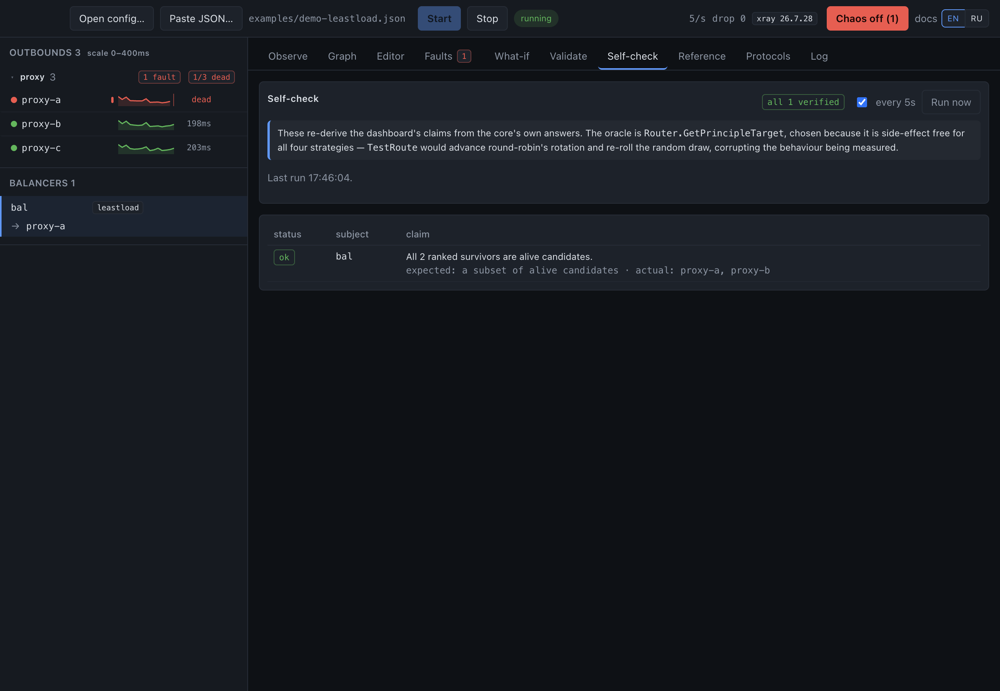

Everything this application says about Xray is an assertion about someone else's code.
These checks re-derive those assertions from the core's own answers, continuously, so a
wrong one becomes visible instead of quietly misleading.

The oracle is `Router.GetPrincipleTarget`, chosen because it is side-effect free for all
four strategies. `TestRoute` would advance round-robin's rotation index and re-roll the
random draw — corrupting the very behaviour being measured.

## Reference — the parameter index

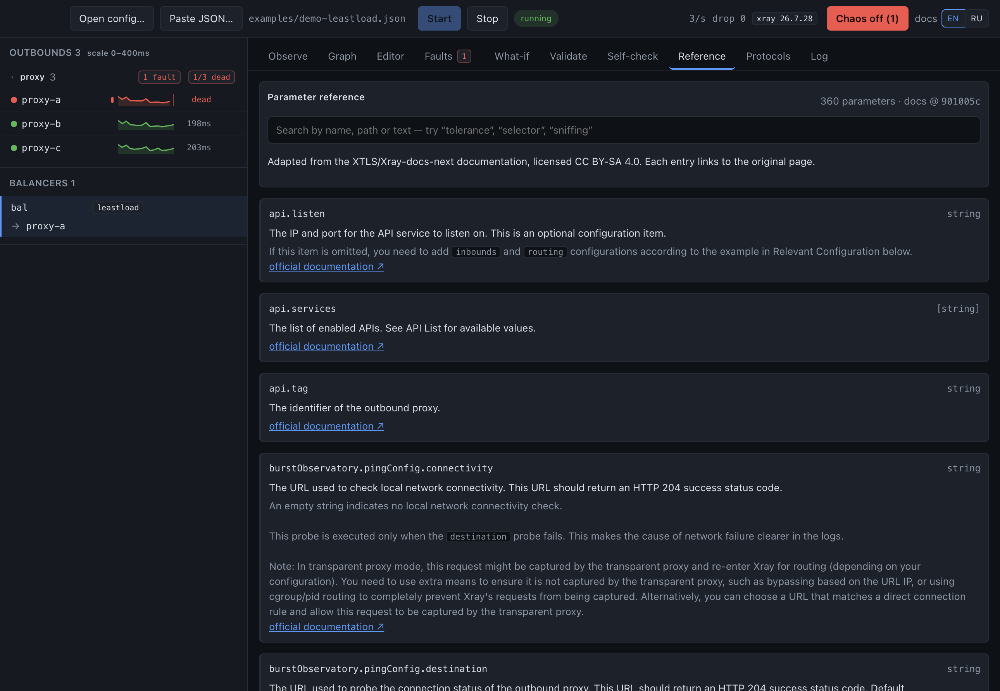

360 configuration parameters, searchable by name, path or text, generated by
`tools/docsgen` from a pinned commit of XTLS/Xray-docs-next. The same text is what the
`?` hints and the editor's hover popups show.

Pinned for the same reason the core is: unpinned upstream text would silently change
what this tool tells you about your config. The bundle exists in English and Russian —
upstream publishes both — and the switch is in the topbar, marked `docs` because it
changes the documentation only. The fallback is per *parameter* rather than per bundle,
so a key the translation has not reached yet still shows its English description instead
of an empty tooltip.

## Protocols — the part reflection cannot see

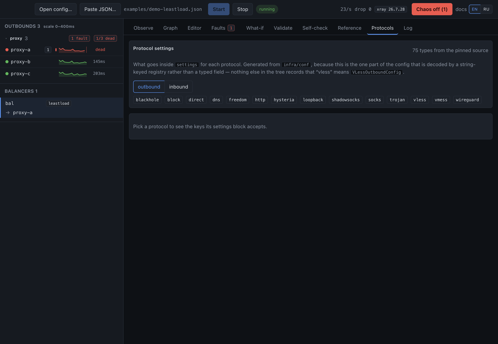

The validator derives its known keys by reflecting over `conf.Config`, which is exact
and can never drift from the linked core — but `inbounds[].settings` and
`outbounds[].settings` are a `json.RawMessage` decoded later by a string-keyed registry,
and reflection stops at that boundary.

`tools/schemagen` recovers the mapping by parsing the registry literals with `go/ast`,
because the source is the only place that records that `"vless"` means
`VLessOutboundConfig`. Descriptions come from the official documentation where it has
them and from the field's own source comment otherwise, always labelled so the two are
never confused.

## Log — the core's own logger, teed

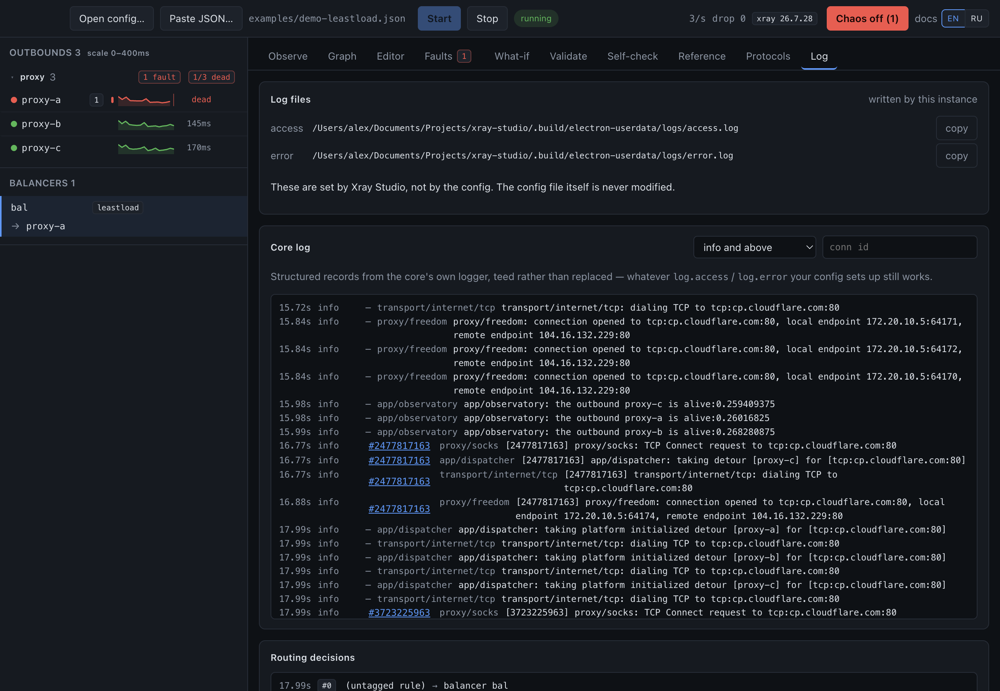

Structured records straight from Xray's log handler, filterable by severity, package and
connection id — teed rather than replaced, so whatever `log.access` and `log.error` your
config sets up keeps working.

Two entries are worth pointing at. *"no rule matched → default outbound"* is
reconstructed from a routing event that Xray does not otherwise surface: nothing
matched, so traffic silently took the first outbound in the file. And a second-pass
match tells you `IPIfNonMatch` resolved the domain and re-ran the rules against the
addresses.

The log paths themselves are shown at the top of the tab. The application substitutes
its own, always, on every platform — a config written on one machine names log
directories that do not exist on another, and Xray refuses to start rather than
continuing without a log file.
